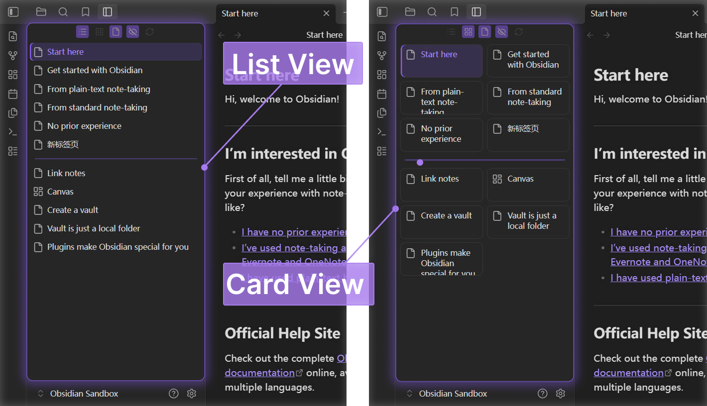

# Obsidian Lite Tabs

English | [中文](#中文)

Lite Tabs is a lightweight Obsidian plugin that displays the tabs currently open in the editor area in a independent sidebar panel, with a focus on fast switching and low runtime overhead.



## Features

- Vertical list or card-style tab view.
- Click to activate a tab, middle-click or use the close button to close a tab, and drag to reorder tabs.
- Minimal display options: hide file icons, toolbar, or inactive tabs.
- Customizable styles: size of the vertical list or card view, font size, divider size, and basic highlight style.

## Performance

- Event-driven updates with no polling.
- Uses `requestAnimationFrame` to batch refreshes.
- Reuses existing item DOM elements whenever possible.
- Updates only the active-state class when the active tab changes.
- Does not maintain large persistent caches or synchronize custom group titles.

## Installation

Download `main.js`, `manifest.json`, and `styles.css` from the release, then place them in:

```text
Vault/.obsidian/plugins/lite-tabs/
```

Restart Obsidian and enable `Lite Tabs` under Community Plugins.

## Build

```bash
npm install
npm run build
```

The production build outputs `main.js` to the repository root.

## Commands

- `Open Lite Tabs`: Open or reveal the Lite Tabs panel.
- `Refresh Lite Tabs panel`: Rebuild the panel based on the current workspace state.

# 中文

Lite Tabs 是一个轻量级 Obsidian 插件，用独立侧边栏面板展示当前编辑区打开的标签页，保持低运行开销。

## 功能

- 垂直列表/卡片标签页视图。
- 单击激活，中键或关闭按钮关闭，拖动排序。
- 精简样式选项：隐藏文件图标、工具栏、非活跃标签页。
- 自定义样式：垂直列表/卡片视图尺寸、字体、分割线尺寸、基础高亮样式

## 性能

- 事件驱动更新，不使用轮询。
- 使用 `requestAnimationFrame` 合并刷新。
- 尽量复用已有条目 DOM。
- 活跃标签变化只更新活跃状态 class。
- 不维护大体量持久缓存，不同步自定义分组标题。

## 安装

从 release 下载 `main.js`、`manifest.json` 和 `styles.css`，放入：

```text
Vault/.obsidian/plugins/lite-tabs/
```

重启 Obsidian 后，在第三方插件中启用 `Lite Tabs`。

## 构建

```bash
npm install
npm run build
```

生产构建会把 `main.js` 输出到仓库根目录。

## 插件命令

- `Open Lite Tabs`：打开或显示 Lite Tabs 面板。
- `Refresh Lite Tabs panel`：根据当前工作区状态重建面板。
